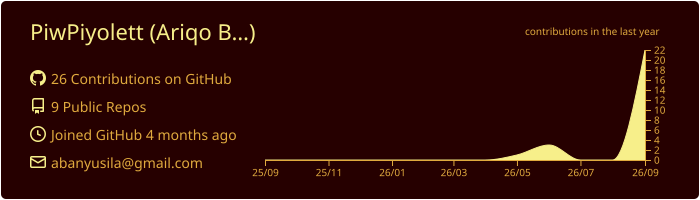
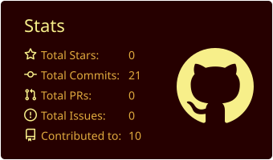
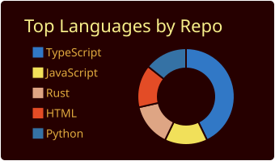
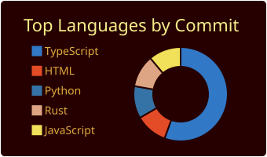
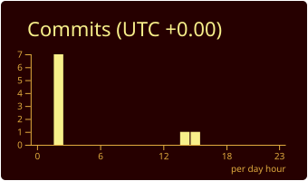

 

---

### 👋 About Me

- 🤖 **AI Engineer & App Builder** yang membangun aplikasi cerdas dari ide hingga jadi.
- 🛠️ Suka membangun hal nyata: aplikasi **mobile, desktop, dan web** untuk kebutuhan sehari-hari.
- 🧠 Antusias mengeksplorasi **LLM & AI generatif** (Claude, Gemini) dan menerapkannya ke masalah nyata.
- 📚 Terus belajar seputar AI dan senang bereksperimen membangun sesuatu yang baru.

---

### 🧰 Tech Stack

**Bahasa**

**Framework & Platform**

**Data & AI**

---

### 📊 Statistik GitHub

 

---

### 🐍 Kontribusi

---

**Thank You**

